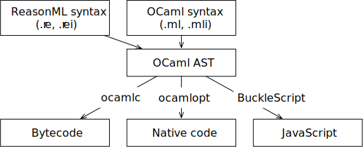

# 什么是 ReasonML ?

> 本章简要介绍了 Facebook 的新编程语言 [ReasonML](https://reasonml.github.io/)

## 什么是 ReasonML ?

ReasonML 是在 Facebook 创建的一种新的对象函数编程语言。实质上，它是编程语言 OCaml 的新 C 语言语法。新的语法旨在与JavaScript进行互操作，并且更容易被
JavaScript 程序员采用。此外，它消除了 OCaml 语法的特性。ReasonML 还支持 JSX（ Facebook 的 React 框架使用的 JavaScript 内部 HTML 模板的语法）。由于
ReasonML 基于 OCaml，许多人可以互换使用这两个名称。下图显示了 ReasonML 如何适合OCaml生态系统。



目前，ReasonML 的默认编译目标是 JavaScript（浏览器和 Node.js ）。

这就是ReasonML代码的样子：

```ocaml

type color = Red | Green | Blue;

let stringOfColor(c) =>
    switch (c) {
        | Red => "Red"
        | Green => "Green"
        | Blue => "Blue"
    };

```