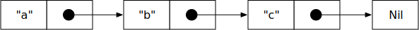

# 列表

> 在本章中，我们看看 ReasonML数据结构列表。

列表是一系列元素的不可变数据结构，它们都具有相同的类型。它特别适合通过模式匹配进行处理。

## 简短的预览：类型签名

在本章中，您将看到许多类型签名，例如：

```ocaml
let map: ('a => 'b, list('a) => list('b));
```

类型签名对你来说似乎仍然很神秘。但是你会从学习如何阅读它们中获益。让我们来探索一下签名类型告诉我们关于 `map` 的东西 - 我们不知道 `map` 是什么或者做什么的（这将在后面解释）。见解：

- `let map:(«parameters») =>  «result»;` map 是一个函数。
- `'a => 'b` `map` 的第一个参数是一个从 `'a` 到 `'b` 类型的函数。前面的撇号表示 `'a` 和 `'b` 是类型变量：它们接受任何类型。但是一旦一个变量接受了一个特定的类型，它从此只能接受这种类型。
- `list('a)` `map` 的第二个参数是一个列表，其元素的类型是 `'a`。
- `list('b)` `map` 的结果是一个列表，其元素是类型 `'b`。

## 用于列表和数组的标准库函数

列表的原始标准库模块是 [List](https://reasonml.github.io/api/List.html) 。它具有以下函数：

```ocaml
let map: ('a => 'b, list('a)) => list('b);
```

模块 List 还有一个带标签的版本 [ListLabels](https://reasonml.github.io/api/ListLabels.html) 。它具有以下功能：

```ocaml
let map: (~f: 'a => 'b, list('a) => list('b));
```

您可以使用一种技巧，并通过打开[模块 StdLabels](https://reasonml.github.io/api/StdLabels.html) 将它们的标签版本“替换”几个常规模块：

```ocaml
open StdLabels;
```

此模块具有子模块 Array，Bytes，List 和 String，它们是全局 ArrayLabels 等的别名。因此，如果您打开它，则会覆盖Array 的未标记实现等。

## 列表的结构

#### 通过自递归参数化变体列表

列表是一个自递归参数化变体。如果你要自己定义它，这就是它的样子：

```ocaml
type mylist('a) =
    | Nil
    | Cons('a, mylist('a))
```

`Nil` 和 `Cons` (“构造”)的名称是历史的，源自 Lisp 编程语言。你嵌套 `Cons` 创建列表:

```ocaml
# let abc = Cons("a", Cons("b", Cons("c", Nil)));

let abc: mylist(string) = Cons("a", Cons("b", Cons("c", Nil)));
```

`mylist` 的类型参数为 `'a`。它传递给 Cons 和 `mylist` 的递归使用。这意味着两件事：首先， `mylist` 的元素可以有任何类型。其次，它们都必须具有相同的类型。在之前的与 ReasonML 的交互中，你可以看到它自动推断出对于 abc，'a 是字符串。

abc 是一个单链表的列表。在内存中，它可能看起来像这样：



一个 cons 对的两部分被称为：
- 头（或第一个）：这是当前列表的第一个值。
- 尾巴（或剩余的）：它指向其他元素的另一个列表。

#### 创建和模式匹配 ReasonML 的列表

ReasonML 对列表有特殊的语法。这两个构造函数是：

- 空的列表 []。
- cons 对[head, ...tail]。

因此，模式匹配就像这样：

```ocaml
switch myList {
    | [] => ...
    | [head, ...tail] => ...
}
```

这是从上一节重新创建 abc 列表的一种方法：

```ocaml
# let abc = ["a", ...["b", ...["c", ...[]]]];
let abc: list(string) = ["a","b","c"];
```

你可以看到 rtop 提出了下面的更紧凑的语法，这是相当的：

```ocaml
# let abc = ["a", "b", "c"];
let abc: list(string) = ["a", "b", "c"];
```

我们使用模式匹配来计算任何列表 myList 的长度：

```ocaml
let rec len = (myList: list('a)) =>
    switch myList {
        | [] => 0
        | [_, ...tail] => 1 + len(tail)
    };
```

我们递归两个构造函数：

- 一个空列表的长度为 0。
- 非空列表的长度为：1 加上尾部的长度。

类型参数 'a 使函数 len 通用。但是我们从来没有对这些元素的类型感兴趣，只是在列表的结构中。以下交互使用 len 与各种列表：

```ocaml
# len([]);
- : int = 0

# len(["a", "b", "c"]);
- : int = 2

# len([1, 2, 3, 4]);
- : int = 4
```

#### 打印列表

ReasonML 没有内置的打印复杂数据结构的支持。但 BuckleScript 允许您使用 JavaScript 的 console.log()。最好使用这样的功能：

```ocaml
Js.log(Array.of_list(myList));
```

在我们打印 myList 列表之前，我们将它转​​换为一个数组。但为什么？它导致更好的输出，因为 ReasonML 列表在JavaScript 中表示为嵌套的 2 元素数组（cons对的编码）。

#### 更多创建列表的方法

三点构造函数也被称为展开运算符。此运算符允许您在现有列表之前添加零个或多个元素：

```ocaml
# [...["a", "b"]];
- : list(string) = ["a", "b"]

# ["a", ...["b", "c"]];
- : list(string) = ["a", "b", "c"]

# ["a", "b", ...["c", "d"]];
- : list(string) = ["a", "b", "c", "d"]

```

唉，这个操作员只能在最后工作。在 JavaScript中，您可以在任何地方使用它，但在 ReasonML中，您不能：

```ocaml
# [...["a", "b"], ...["c", "d"]];
Error: Syntax error
```

ReasonML 有自己的连接列表运算符：

```ocaml
# ["a", "b"] @ ["c", "d"];
- : list(string) = ["a", "b", "c", "d"]
```

请注意，连接列表比较慢，因为您必须将第一个操作数的每个元素预先添加到第二个操作数：

```ocaml
let rec append = (l1: list('a), l2: list('a)) =>
    switch l1 {
        | [] => l2
        | [head, ...tail] => [head, ...append(tail, l2)]
    };
```

这是你如何使用 `append`：

```ocaml
# append([1, 2, 3], [4, 5]);
- : list(int) = [1, 2, 3, 4, 5]
```

#### 这是工作中的类型推断:

- 首先，ReasonML 推断 `1` 等的类型为 `int。`
- 然后它将例如第一个输入列表的类型推断为 `list(int)` ：
```ocaml
# [1,2,3];
- : list(int) = [1, 2, 3]
```
- 然后它检查了 `l1` 和 `l2` 对于类型参数 `'a` 具有相同的值。
- 最后，它使用 `l1` 和 `l2` 的类型数据来推断 `append` 结果的类型 `list(int)`。

## 示例：创建列表

range() 创建一个 int 列表：

```ocaml
/**
 * 计算以 `start` 开始的整数列表,
 * 直到并排除 `end_`。
 */

let rec range = (start: int, end_: int) => 
    if (start >= end_) {
        [];
    } else {
        [start, ...range(start + 1, end_)];
    };

```

`end` 是 ReasonML 中的关键字，因此不是合法的变量名称。

这就是为什么参数 `end_` 在其名称中具有下划线的原因。让我们试试 `range()` ：

```ocaml
# range(0, 0);
- : list(int) = []

# range(0, 1);
- : list(int) = [0]

# range(0, 5);
- : list(int) = [0, 1, 2, 3, 4]
```

`fill()` 创建一个用 `~element` 填充的列表：

```ocaml
/**
 * 创建一个长度为 “ ~length ” 的列表，其中每个
 * 元素是 `~element`。
 */

let rec fill = (~element: 'a, ~length: int) => 
    if(length <= 0) {
        [];
    } else {
        [element, ...fill(~element, ~length = length - 1)];
    };

```

ReasonML使用 `~element` 的类型来推断结果的类型：

```ocaml
# fill("x", 4);
- : list(string) = ["x", "x", "x", "x"]

# fill(0, 3);
- : list(int) = [0, 0, 0]
```

## 示例：读取列表

#### 计算列表的总和

summarize() 计算列表中所有整数的总和：

```ocaml
/*
 * 计算列表'l`中所有 int 的总和。
 *
 */

let rec summarize = (l: list(int)) => 
    switch l {
        | [] => 0
        | [head, ...tail] => head + summarize(tail)
    };

summarize([]); /* 0 */
summarize([3]); /* 3 */
summarize([1, 2, 3]); /* 6 */
```

#### 访问第n个列表元素

getElementAt() 通过索引检索列表元素：

```ocaml
/**
 * 获取索引处的列表元素 `~index`.
 * 列表的头部有索引 0,
 * 它尾巴的头部指数 1, etc.
 */

let rec getElementAt = (~index: int, l: list('a)) =>
    switch l {
        | [] => None
        | [head, ...tail] =>
            if (index <= 0) {
                Some(head);
            } else {
                getElementAt(~index = index - 1, tail);
            }
    };


```

如果我们提供一个 `when` 子句和一个额外的 `case` 给 switch ，我们可以消除 `if-then-else` 表达式。由此产生的平面结构稍微容易阅读：

```ocaml
let rec getElementAt = (~index: int, l: list('a)) =>
    switch l {
        | [] => None
        | [head, ..._] when index <= 0 => Some(head)
        | [head,...tail] => getElementAt(~index = index - 1, tail)
    };
```

本代码中有一些值得注意的事情：

- Failure 通过变体类型 option 处理：
    - None 意味着我们失败了。
    - Some(x) 意味着我们成功了，结果为x。
- 索引 0 指当前的头（第二种情况）。
- 如果我们到达 [] 列表的末尾，我们就失败了。如果 l 为空或者在 ~index 为 0  之前我们达到了结尾，则触发第一种 switch 情况。
- 标准库具有像 getElementAt() 那样工作的 [ListLabels.nth()](https://reasonml.github.io/api/ListLabels.html)，但它为非法索引引发异常，它不使用 option。

## 示例：更改列表

鉴于列表是不可变的 - 你如何改变它们？为了找到答案，考虑到目前为止，我们已经看到了两种算法：

- 通过递归遍历它们的结构来从列表中读取数据的算法。例如：`len()`，`summarize()` 等。
- 通过递归构建新结构创建列表的算法。例如：`range()` ，`fill()` 等

要更改列表，我们将两种方法结合起来：根据需要，我们创建一个全新的列表并包含现有列表中的数据或从中导出数据。

#### removeAll()

以下是更改现有列表的函数的第一个示例。

```ocaml
/**
 * 从列表 `l` 中删除所有元素
 * 等于 `~value`.
 */

let rec removeAll = (~value: 'a, l: list('a)) =>
    switch l {
        | [] => []
        | [head, ...tail] when head == value => removeAll(~value, tail)
        | [head, ...tail] => [head, ...removeAll(~value, tail)]
    };

```

第一种情况意味着我们完成了。第三种情况是对现有列表的精确复制。第二种情况是删除等于 `~value` 的元素。

这是 `removeAll()` 的应用：

```ocaml
# removeAll(~value = 9, [1, 9, 2, 9, 3]);
- : list(int) = [1, 2, 3]
```

#### replaceAll()

`replaceAll()` 替换值：

```ocaml
/**
 * 在列表 `l` 内，删除所有出现的值 '~value`
 * 值为 '~with_`。
 */
let rec replaceAll = (~value: 'a, ~with_: 'a, l: list('a)) =>
    switch l {
        | [] => []
        | [head, ...tail] when head == value =>
            [with_, ...replaceAll(~value, ~with_, tail)]
        | [head, ...tail] =>
            [head,...replaceAll(~value, ~with_, tail)]
    };

```

第一种情况意味着我们完成了。第三种情况做了一个确切的副本。第二种情况作了替代。

我们可以通过内部帮助函数 `replaceOne()` 使 `replaceAll()` 更紧凑：

```ocaml
let rec replaceAll = (~value: 'a, ~with_: 'a, l: list('a)) => {
    let replaceOne = (x) => if (x == value) with_ else x;
    switch l {
        | [] => []
        | [head, ...tail] =>
            [replaceOne(head), ...replaceAll(~value, ~with_, tail)]
    };
};
```

这是 `replaceAll()` 的应用

```ocaml
# replaceAll(~value=1, ~with_ = 11, [1, 2, 1, 3]);
- : list(int) = [11, 2, 11, 3]
```

#### drop()

`drop()` 删除列表元素：
```ocaml
/**
 * 删除 `theList` 的第一个`~count`元素。
 *
 */
let rec drop = (~count, theList: list('a)) =>
    switch theList {
        | [] => []
        | l when count <= 0 => l
        | [_, ...tail] => drop(~count = count - 1, tail)
    };

```

让我们使用 `drop()`：

```ocaml
# drop(~count = 0, ["a", "b", "c", "d"]);
- : list(string) = ["a", "b", "c", "d"]

# drop(~count=2, ["a", "b", "c", "d"]);
- : list(string) = ["c", "d"]

# drop(~count=2, ["a", "b"]);
- : list(string) = []

# drop(~count=2, ["a"]);
- : list(string) = []

# drop(~count=2, []);
- : list('a) = []

```

对于 `drop()` 的最后一个结果，ReasonML 不能推断出元素类型，并且保持类型参数 `'a` 未绑定。

## 列表的标准库函数

ReasonML 的标准库仍处于不断变化之中。因此，我们只在这里看一些亮点。您可以通过 [ListLabels 的文档](https://reasonml.github.io/api/ListLabels.html)来阅读其余部分（因为它现在存在）。

#### ListLabels.map()

签名：

```ocaml
let map: (~f: 'a => 'b, list('a)) => list('b);
```

`map()` 接受一个带有 `'a` 类型元素的列表，将函数 `~f` 应用到每个元素并将结果返回到另一个列表中。

```ocaml
# ListLabels.map(~f = x => int_of_sting(x), ["7", "15", "6"]);
- : list(int) = [7, 15, 6]
```

该函数是处理数据列表的经典工具。

`mapi()` 是 `map()` 的一个版本，它将当前元素和元素的索引传递给回调函数 `~f`。我们可以使用 `mapi()` 来非破坏性地更新列表：

```ocaml
/**
 * 创建一个“theList”的副本，它的索引“~index”的元素。
 * 是 `~value`.
 */

let setElementAt = (~index: int, ~value: 'a, theList: list('a)) =>
    ListLabels.mapi(
        ~f=(i, x) => if (i == index) value else x,
        theList
    );

```

参数 `~f` 传递所有元素不变，除了索引 `~index` 处的元素。

这是 setElementAt() 的使用:

```ocaml
# setElementAt(~index=1, ~value="|", ["a", "b", "c"]);
- : list(string) = ["a", "|", "c"]
```

#### ListLabels.filter()

这是该函数的签名：

```ocaml
let filter: (~f: 'a => bool, list('a)) => list('a);
```

`filter()` 将函数 `~f` 应用于其位置参数的每个元素。如果它返回 `true` ，则该元素将包含在结果中。如果它返回`false`，那不是。它的用法如下。

```ocaml
# ListLabels.filter(~f = x => x > 5, [8, 4, 9, 7, 2]);
- : list(int) = [8, 9, 7]
```

#### ListLabels.for_all()

签名：

```ocaml
let for_all: (~f: 'a => bool, list('a)) => bool;
```

如果 `~f` 对列表中的每个元素返回 `true` ，`for_all()` 将返回 `true` 。例如：

```ocaml
# ListLabels.for_all(~f = x => x > 3, [4, 5, 6]);
- : bool = true

# ListLabels.for_all(~f = x => x > 3, [3, 4, 5, 6]);
- : bool = false
```

只要 `~f` 返回 `false` ， `for_all` 立即停止处理。然后结果保证是 `false` 。  `for_all` 以数学运算符 ∀ 命名。

`ListLabels.exists()` 与 `for_all()` 相关：如果其回调对其列表中的至少一个元素返回 `true` ，则返回 `true` 。 `exists` 以数学操作符 ∃ 命名。

#### ListLabels.flatten()

签名：

```ocaml
let flatten: list(list('a)) => list('a);
```

`flatten()` 通过连接 `l` 的元素将列表 `l` 的列表转换为列表。也就是说，以下三个表达式是等价的：

```ocaml
flatten([l1, l2, l3])
ListLabels.append(l1, ListLabels.append(l2, l3))
l1 @ l2 @ l3

```

这是如何使用 `flatten()`：

```ocaml
# ListLabels.flatten([1, 2], [], [3, 4, 5]);
- : list(int) = [1, 2, 3, 4, 5]
```

如果您想知道任意嵌套的列表，请回想一下，在 ReasonML 中，所有元素必须具有相同的类型。因此，如果一个列表元素本身就是一个列表，那么所有元素都必须是列表：

```ocaml
# ListLabels.flatten([[1,[2]],[],[3]]);
错误：该表达式具有类型 list('a) 
但预期类型为int的表达式

# ListLabels.flatten([[[1],[2]], [],[[3]]]);
- : list(list(int)) = [[1], [2], [3]]
```

让我们继续查看 `flatten()` 的用例。

#### 用例：同时进行过滤和映射

`flatten()` 允许您同时过滤和映射。作为例子，考虑试图提取存储在列表中的多个列表的第一个元素。你可以：

- 首先通过 `ListLabels.filter()` 过滤出空列表（没有第一个元素）。
- 然后通过 `ListLabels.map()` 将每个非空列表映射到其头部。

或者你可以同时使用扁平化和两种方法：

```ocaml
module L = ListLabels;

let listFromHead = (l: list('a)) => 
    switch (l) {
        | [] => []
        | [head, ..._] => [head]
    };
let heads = (l: list((list('a)))) => 
    L.flatten(L.map(~f=listFromHead, l));
```

首先，我们将每个非空列表映射到一个列表中，并将其头部和每个空列表映射到一个空列表。然后我们把结果弄平。这看起来如下：

```ocaml
# let l0 = [[1,2], [], [3, 4, 5]];
let l0: list(list(int)) = [[1, 2], [], [3, 4, 5]];

# L.map(~f=listFromHead, l0);
- : list(list(int)) = [[1], [], [3]]
# let l1 = L.map(~f=listFromHead, l0);
let l1: list(list(int)) = [[1], [], [3]];

# L.flatten(l1);
- : list(int) = [1, 3]
```

这些步骤相当于：

```ocaml
# heads([[1, 2], [], [3, 4, 5]]);
- : list(int) = [1, 3]
```

将 `listFromHead` 与使用 `option` 表示失败的函数 `getHead` 进行比较是有益的：

```ocaml
let getHead = (l: list('a)) => 
    switch (l) {
        | [] => None
        | [head, ..._] => Some(head)
    };
```

也就是说， `None` 表示“l 没有头”：

```ocaml
# getHead(["a", "b"]);
- : option(string) = Some("a")
# getHead([1, 2, 3])
- : option(int) = Some(1)

# getHead([]);
- : option('a) = None

```

使用 `listFromHead` ，我们使用空列表代替 `None` 和使用一个元素列表代替 `Some` 。

#### 用例：映射到多个值

假设我们已经创建了一个人和他们的孩子的列表：

```ocaml
type person = Person(string, list(string));

let person = [
    Person("Daisy", []),
    Person("Della", ["Huey", "Dewey", "Louie"]),
    Person("Marcus", ["Minnie"])
];

```

如果我们想收集列表中的孩子，`ListLabels.map()` 几乎给了我们我们想要的，但不是很：

```ocaml
# ListLabels.map(~f=(Person(_, ch)) => ch, persons);
- : list(list(string)) = [[], ["Huey", "Dewey", "Louie"], ["Minnie"]]
```

唉，这是一串字符串列表，而不是字符串列表。我们可以通过将 `ListLabels.flatten()` 应用于此嵌套列表来解决此问题：

```ocaml
let collectChildren = (persons: list(person)) =>
    ListLabels.flatten(ListLabels.map(~f=(Person(_, children)) => children, persons));

collectChildren(persons);
/* ["Huey", "Dewey", "Louie", "Minnie"] */
```

现在我们得到期望的结果：

```ocaml
# collectChildren(persons);
- : list(string) = ["Huey", "Dewey", "Louie", "Minnie"]
```

#### 用例：有条件地插入值

有时，根据条件创建一些列表，其中添加或省略了一些元素（以下示例中的 `cond` ）：

```ocaml
let func = (cond: bool) => ListLabels.flatten([
    if (cond) ["a"] else [],
    [
        "b",
        "c"
    ]
]);
```

这是如何使用 `func()` 的：

```ocaml
# func(true);
- : list(string) = ["a", "b", "c"]

# func(false);
- : list(string) = ["b", "c"]

```

#### ListLabels.fold_left()

签名：

```ocaml
let fold_left: (~f: ('a, 'b) => 'a, ~init: 'a, list('b)) => 'a;
```

`fold_left()` 的工作原理如下：

- 输入：类型 `list('b)`（最后一个参数）
- 结果：类型 `'a` 的值

为了计算结果，`fold_left()` 取决于它的参数函数 `~f` 。它为其输入列表的每个元素 `elem` 调用 `~f`：

```ocaml
let nextIntermediateResult = f(intermediateResult, elem);
```

`intermediateResult` 是已经计算好的。第一个中间结果是 `~init` 。最后一个 `nextIntermediateResult` 是`fold_left()` 的结果。

我们来看一个具体的例子。

#### fold_left() 举例：summarize()

我们已经遇到过函数 `summarize()`，它计算了一个 `int` 列表的总数。让我们通过 `fold_left()` 来实现该功能：

```ocaml
let rec summarize = (l: list(int)) => 
    ListLabels.fold_left(~f = (r, elem) => r + elem, ~init=0, l);
```

要理解 `summarize()` 的工作方式，请考虑以下表达式：

```ocaml
summarize([1, 2, 3]) /* 6 */
```

为了计算结果6，采取以下步骤：

```ocaml
/* 参数 */
let f = (r, elem) => r + elem;
let init = 0;

/* 步骤 */
let result0 = f(init, 1); /* 1 */
let result1 = f(result0, 2) /* 3 */
let result2 = f(result1, 3) /* 6 */

```

`result2` 是 `fold_left()` 的结果。

#### 另一种查看 fold_left() 的方法

另一种查看 `fold_left()` 的方法是将二元运算符 `~f` 转换为列表的 `n` 元运算符。数学中从二元到 `n` 元的例子是二元算子 `+` 也存在为 `n` 元版本（算子 `Σ` ）。`summarize()` 从 `+` 到 `Σ` 。它也可以这样写：

```ocaml
# ListLabels.fold_left(~f=(+), ~init=0, [1, 2, 3]);
- : int = 6
```

我发现 `fold_left` 最容易理解，如果它在这种模式下工作 - 一个可交换的 `~f`（参数顺序无关紧要）。但是你可以用它做很多事情 - 看一个例子。

#### 一个更复杂的例子：查找值

函数 `contains()` 使用它在列表中查找值：

```ocaml
let contains = (~value: 'a, theList: list('a)) => {
    let f = (found, elem) => found || elem == value;
    fold_left(~f, ~init=false, theList);
};
```

通过 `iteri()` 将列表转换为数组

签名：

```ocaml
let iteri: (~f: (int, 'a) => unit, list('a)) => unit;
```

`iteri()` 为列表的每个元素调用 `~f` 。参数是元素和元素的索引。它返回 `unit` ，这意味着任何有用的 iteri，它会产生副作用。

以下函数使用 `iteri()` 来填充数组。它通过写入数组 `arr` 来做为副作用：

```ocaml
let arrayFromList = (~init: 'a, l: list('a)) => {
    let arr = ArrayLabels.make(ListLabels.length(l), init);
    ListLabels.iteri(~f=(i, x) => arr[i] = x, l);
    arr;
};
```

`~init` 是一个必需的参数，因为 `make()` 需要它（为什么稍后解释）。

`arrayFromList()` 用法

```ocaml
# arrayFromList(~init=0, [1, 2, 3]);
- : array(int) = [| 1, 2, 3 |]
```

## 接下来要阅读的内容

现在是阅读本书中关于递归的章节的好时机。它会让你更深入地理解递归，并告诉你如何使本章的代码更有效率（通过尾部调用）。


